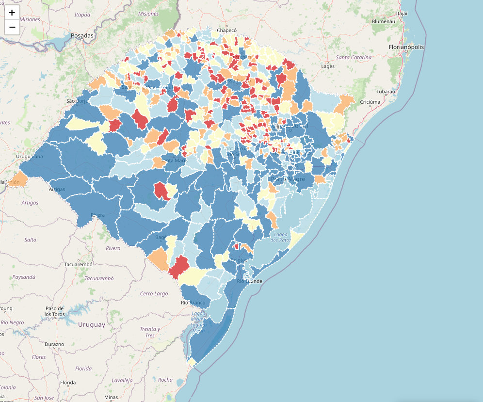

## Seminário 1 - Aplicativo de visualização de dados espaciais

App em shiny sobre a população do Rio Grande do Sul ao longo dos anos 2000.

[Acesse o aplicativo Shiny](https://r8vnor-nicolas-hess.shinyapps.io/app_RS/")
